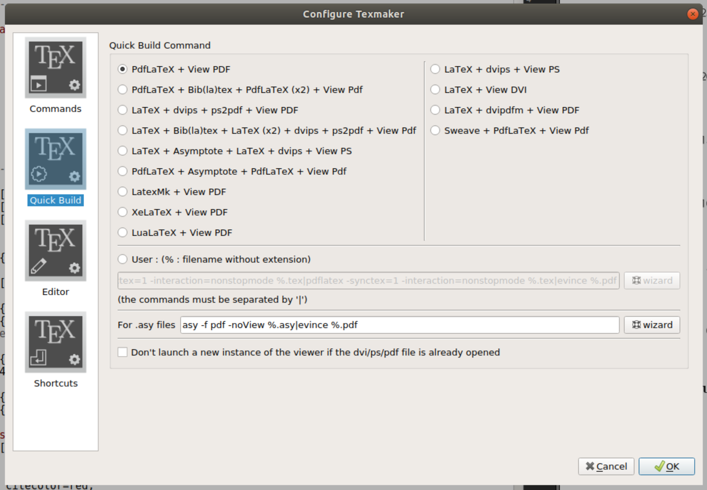

# THI-LaTeX-thesis-template

This repository holds a working copy of Technische Hochschule Ingolstadt Universitie's (THI's) LaTeX thesis template 
which can be used as quick starting point for writing your Thesis using LaTeX.

# Tip for beginners
I, myself didn't have any prior experience with Latex before I began to start writing my Thesis report. So, to get 
acquainted with what Latex is all about and to learn the A, B, C, D,... of Latex, I picked this excellent quick read
[book](https://www.amazon.de/gp/product/1543162649/ref=ppx_yo_dt_b_asin_title_o08_s00?ie=UTF8&psc=1) on Amazon which 
just takes approximately **1 hour** to read from **cover-to-cover**. I highly recommend this book for beginners who do 
not have any prior experience with Latex.

# Getting started
In my opinion one of the most difficult task is getting started easily and quickly with the tool one has to work with, 
which is not an easy task as there are many tools available ranging from online tools like Overleaf to offline tools 
like TexMaker and more. The reason I bring this forth here is because I had my share of difficulty getting started. 
From my experience I have found that [TexMaker](https://www.xm1math.net/texmaker/) to be the most comfortable one 
which pre-installs most of the standard packages required and hence streamlining the setup process.

I myself have written my thesis report on Linux OS for which the TexMaker app is readily available in the ubuntu 
app-store. But, the app is also available for Windows and MacOsX OS's, so, that is comfortable if you want to follow some
 additional information that follows here regarding setup across any operating systems.

To get started, clone this repository to have it locally available for your use or if you are okay with having your report
online publically available, you can fork this repository and work upon it.

```bash
$> cd Documents
$> git clone https://github.com/logicatcore/THI-LaTeX-thesis-template.git
```
Once the files are available, the next step is to start TexMaker and build a sample pdf right away to make sure that 
everything is working and you have your setup ready. Follow the following steps-
* Open TexMaker
* File > Open > Documents/THI-LaTeX-thesis-template/thesis.tex

This opens up the main entry point to your report, if you are familiar with programming, this particular tex file is 
similiar to the `main()` function which gets called automatically.

Now it is time to check if everything works and to do that just click on the **Quick Build** button in the top toolbar. 
After a couple of seconds, the newly built pdf should show up in the in built pdf viewer.

# Configuring Quick Build settings
It is important to know what the **Quick Build** button is doing. Simply put, the button in turn runs a combination of
 commands with each combination having a specific meaning and purpose.

Having not tampered with the settings so far the **Quick Build** settings can be inspected by going to 
Option > Configure Texmaker > Quick Build. This shows the various pre built commands which can be selected to configure
 TexMaker to run those sequence of commands upon clicking the **Quick Build** button.



* `PdfLaTeX + view PDF` is the most leightweight command i.e. takes less time to build your pdf document but it ends up 
using the previously generated auxilliary files which results in the final PDF not reflecting the changes that you have
  made or require to happen.
* `PdfLaTeX + BibLaTeX + PdfLaTeX(x2) + view PDF` is a detailed version which generates the bibliography auxilliary 
files on the first pass and the later PdfLaTeX commands use the auxilliary files to establish links and references in 
  your PDF document.
* Finally here comes a user defined command that I spent a lot of time to get it working correctly and now I am glad to 
share with you so that you do not have to break your head all over again! As you might have noticed in the last command 
  there was only one new command i.e. **BibLaTeX** which successfully handles all the bibliography needs. But, in the
  present state of this thesis template which has been improved upon by me can also generate **nomenclature** page, 
  **Glossary** and **Acronym** page in the report preamble. In order to triger these couple of pages also to be built, 
  add the following command 
  `pdfLaTeX -synctex=1 -interaction=nonstopmode %.tex|bibtex %.aux|makeglossaries %|makeindex %.nlo -s nomencl.ist -o %.nls|pdfLaTeX -synctex=1 -interaction=nonstopmode %.tex|pdfLaTeX -synctex=1 -interaction=nonstopmode %.tex|evince %.pdf`
  in the *User* field and use this for building your final PDF versions or use it ocasionally like after completing one
  chapter or one section.
  
# Saving the workspace i.e. session
It is good to know that the present state of your workspace i.e. all the files that you have open and are visible in 
the *Structure* can be quickly saved to again start from that point the next day where you stopped working the day 
before. To do that just goto File > Session > Save Session > choose-where-you-want-to-save

# When the PDF is not updating as you expected
There might be situations when you make some changes and build your PDF but the PDF behaves like a stubborn little child
and refuses to reflect the changes that you've made. This is caused because, LaTeX acts samrtly sometimes and doesn't 
compile all the auxilliary files again which in turn does not lead to updation of PDF document.

So, if you ever face the following situation I suggest you to run the **clear_misc_files.sh** bash script which just 
removes all the auxilliary files and hence force LaTeX to compile all of them again.

To run it do the following-
```bash
$> chmod +x clear_misc_files.sh
$> ./clear_misc_files.sh
```
  
